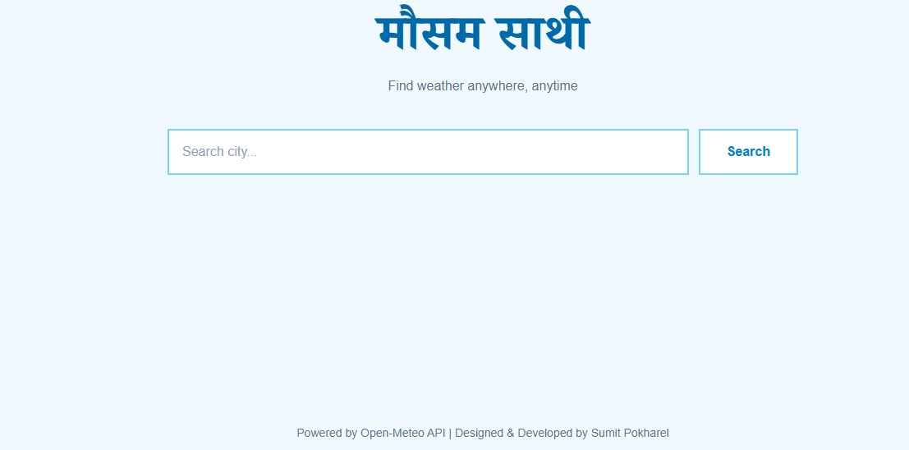
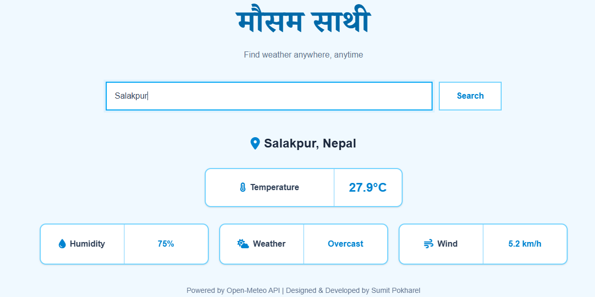

# Weather App 🌤️

A simple weather application built with **React** and the **Open-Meteo API**. Users can search for a city and view its current weather information.

## Features

* 🔍 Search weather by city
* 🌡️ Display temperature
* ☁️ Show weather condition
* 💧 Display humidity
* ⏳ Loading indicator
* ❌ Error handling for invalid cities or API failures

## Preview

### App UI


### Search Result


## Technologies Used

* React
* JavaScript
* Open-Meteo API
* Fetch API
* CSS / Tailwind CSS

## Run Locally

```bash
git clone https://github.com//weather-app.git
cd weather-app
npm install
npm run dev
```

## Author

Developed by **leosum1t** 